## Classroom Activity Monitoring System (CAMS)

[](https://en.wikipedia.org/wiki/Education_technology)
[](https://opencv.org)
[](https://pytorch.org)
[](https://ultralytics.com)
[](https://kafka.apache.org)
[](https://fastapi.tiangolo.com)
[](https://developer.mozilla.org/en-US/docs/Web/API/WebSockets_API)
[](https://reactjs.org)
[](https://www.docker.com)
[](https://www.postgresql.org)

📘 Short description
-----------------
This repository contains the Classroom Activity Monitoring System (CAMS) — an end-to-end project that detects student behaviors (sleeping, mobile usage, attentiveness) using computer vision and streams anonymized activity events through Apache Kafka into a FastAPI backend for storage and real-time lecturer alerts. A React-based dashboard visualizes live and historical engagement analytics.

🔗 Roboflow dataset
----------------
We used a labeled dataset hosted on Roboflow. If you want to review or download it, refer to:

https://universe.roboflow.com/sustainsort-dynamics/mpfinal-kcf25

🗂 Repository structure 
--------------------------------
Look here first — a compact, tree-style view of the repo (click folders in GitHub to explore):

```
CAMS-root/
├─ Backend/
│  └─ classroom-pipeline/
│     ├─ docker-compose.yml      # Kafka, Postgres, FastAPI + producers/consumers
│     ├─ db_init/01_schema.sql    # PostgreSQL schema
│     └─ fastapi_app/             # FastAPI service (consumer, WebSocket, DB)
│        ├─ Dockerfile
│        └─ main.py
├─ Frontend/                      # React dashboard
│  ├─ package.json
│  └─ src/
│     ├─ App.jsx
│     └─ ws/                      # WebSocket client helpers
├─ Dataset/                       # dataset config + small samples + training outputs
│  ├─ data.yaml
│  ├─ Testing-images/
│  │  ├─ 1.png
│  │  └─ 2.png
│  └─ runs/detect/                # training run outputs (results & plots)
├─ Images/                        # documentation and diagrams
│  ├─ Diagrams/
│  ├─ Frontend/
│  └─ Roboflow/
├─ Final_model.ipynb            # notebook for model exploration
└─ README.md                      # (this file)
```

Notes:
- Keep `Backend/classroom-pipeline/` and `Frontend/` as the core deployable components.
- `Dataset/runs/` contains heavy training outputs — consider moving to `docs/assets/` or external storage.
- `Images/Diagrams/` contains architecture and process visuals used in the README.

🔬 Project overview
--------------------------
Domain: Education Technology (EdTech) — student performance analytics and classroom engagement monitoring.

❗ Problem statement
-----------------
Manual monitoring of classroom engagement is subjective and inefficient. CAMS automates detection of student behaviors (sleeping, mobile use, attentiveness) and delivers real-time alerts and analytics to lecturers.

🏗️ Proposed architecture and methodology
----------------------------------------------
- Edge Layer (CCTV + AI Server): Live frames are processed on a GPU-enabled inference server. The model is YOLOv8 (with pose estimation) running on PyTorch/OpenCV. MediaPipe is optionally used for pose features.
- Data Pipeline: Detection results are published as events ({student_id, status, confidence, timestamp}) to Apache Kafka.
- Backend: FastAPI service consumes Kafka events (aiokafka), persists to PostgreSQL (JSONB columns), and broadcasts real-time alerts using WebSockets.
- Frontend: React.js dashboard (WS client) receives live alerts, shows session summaries, and analytics.
- Deployment: Services are containerized with Docker and orchestrated with docker-compose; Kubernetes is an option for scale.

🎯 Expected outcomes & deliverables
--------------------------------
- Real-time alerts for distracted students
- Session-wise and course-wise analytics for engagement
- Persistent anonymized event store (PostgreSQL) for historical analysis
- Deliverables: trained detection model, Kafka pipeline, FastAPI backend, React dashboard, DB schema, Docker deployment

🖥️ Hardware / software specs
-------------------------
- Hardware: CCTV cameras, GPU inference server (NVIDIA Jetson or GPU server)
- Software: PyTorch, YOLOv8, OpenCV, MediaPipe, Apache Kafka, FastAPI, React, PostgreSQL, Docker

⚙️ How to explore this repo locally
--------------------------------------
1. Frontend: in `Frontend/` run `npm install` and `npm start` (created with react-scripts).
2. Backend: `Backend/classroom-pipeline/` contains a docker-compose to bring up Kafka + Postgres + FastAPI + producers/consumers. Use `docker compose up --build` there.
3. Model/Dataset: see `Dataset/` and `CAMS_model_v1.ipynb` for training outputs and sample test images. Roboflow link above has the original labeled dataset.

Images included in this repository (embedded gallery)
----------------------------------------------------
Below are repository images embedded so viewers see a visual overview immediately. If the repo is large, some images may not render on GitHub preview but will be visible when browsing the repository.

### Frontend
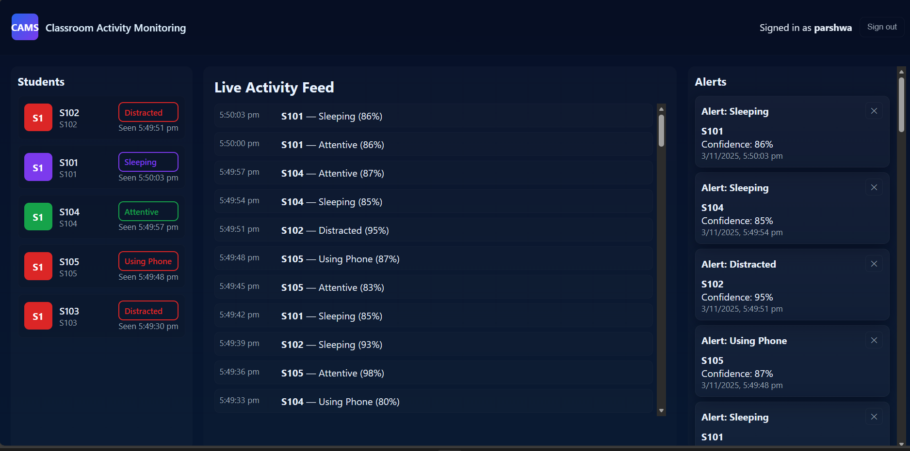
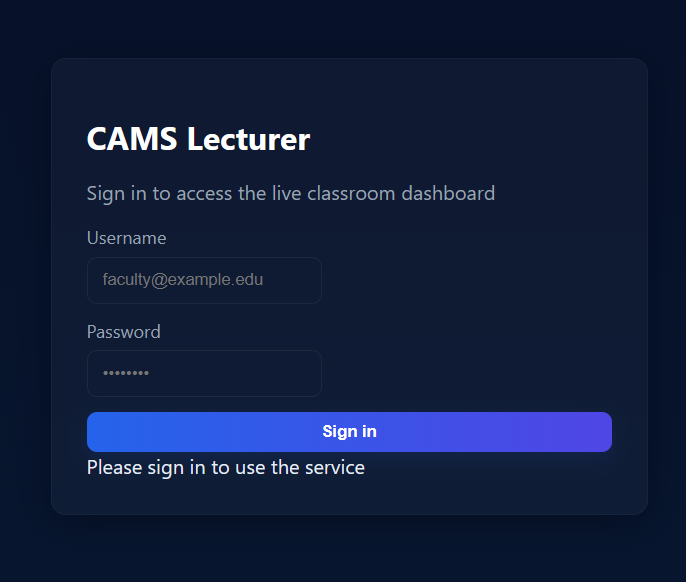
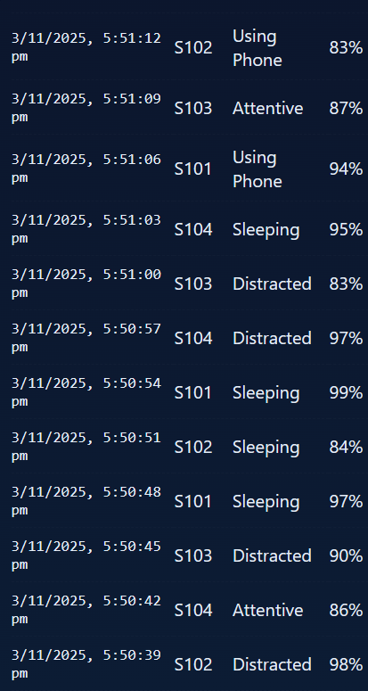
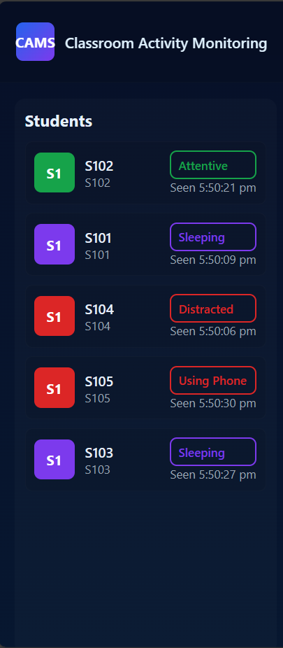
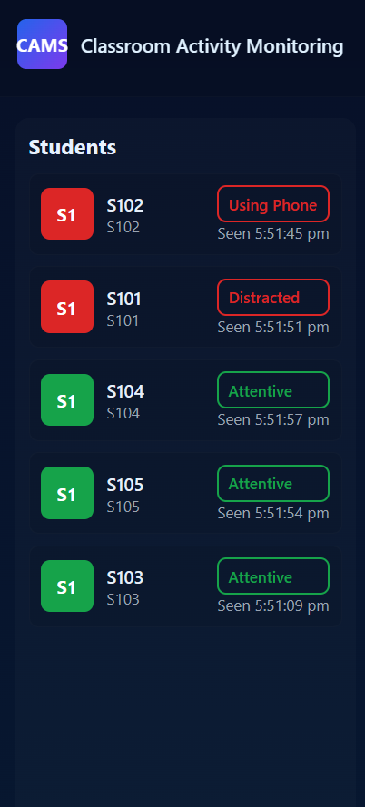

### Backend / Ops
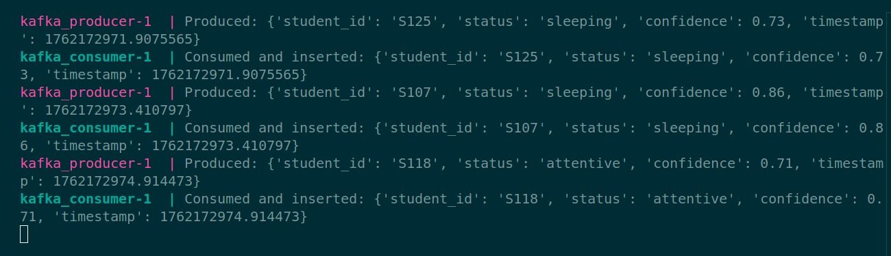
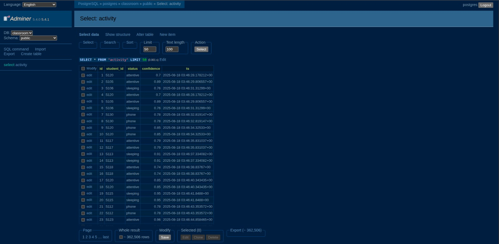

### Diagrams & Architecture
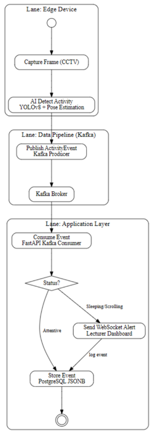
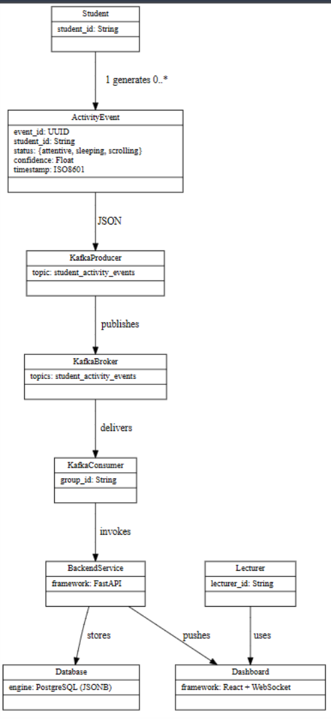
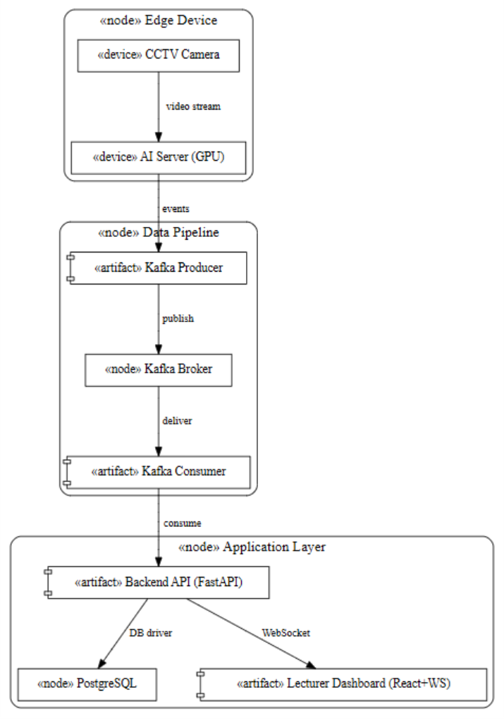
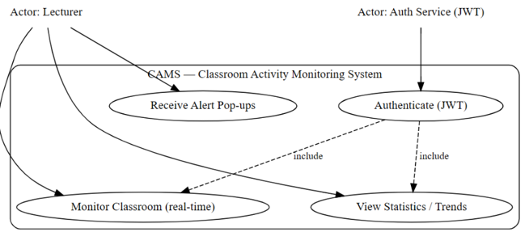
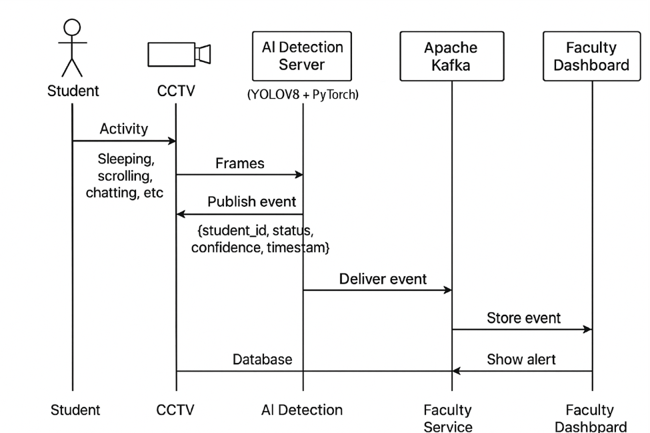
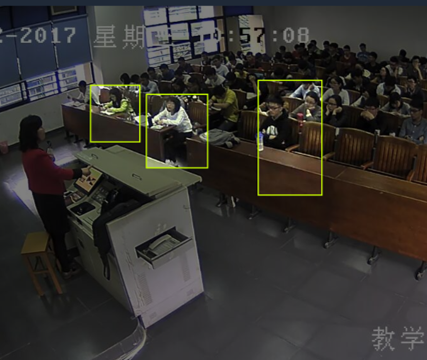
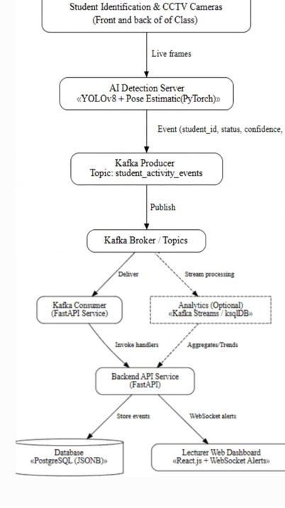

### Roboflow / Dataset screenshots
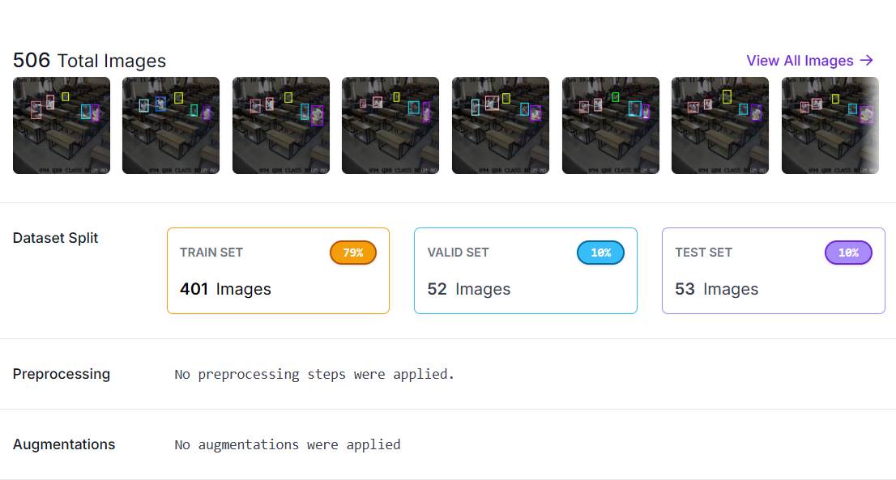
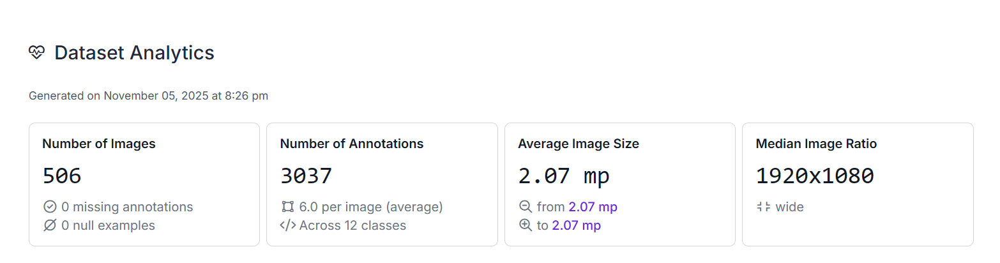
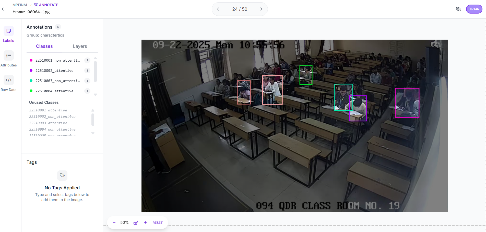

<video src="Images/Roboflow/Output_of_class_recording.mp4" width="450" controls></video>

Empowering educators with real-time, privacy-preserving classroom insights — AI, streaming, and analytics working together for better learning outcomes. 🍎🍪

---

### How to run the backend and frontend

#### Backend
1. Navigate to the `Backend/classroom-pipeline/` directory.
2. Run the following command to build and start the backend services:
    ```bash
    docker compose up --build
    ```
3. The FastAPI backend will be available at `http://localhost:8000`.

#### Frontend
1. Navigate to the `Frontend/` directory.
2. Install dependencies:
    ```bash
    npm install
    ```
3. Start the development server:
    ```bash
    npm start
    ```
4. The React frontend will be available at `http://localhost:3000`.
